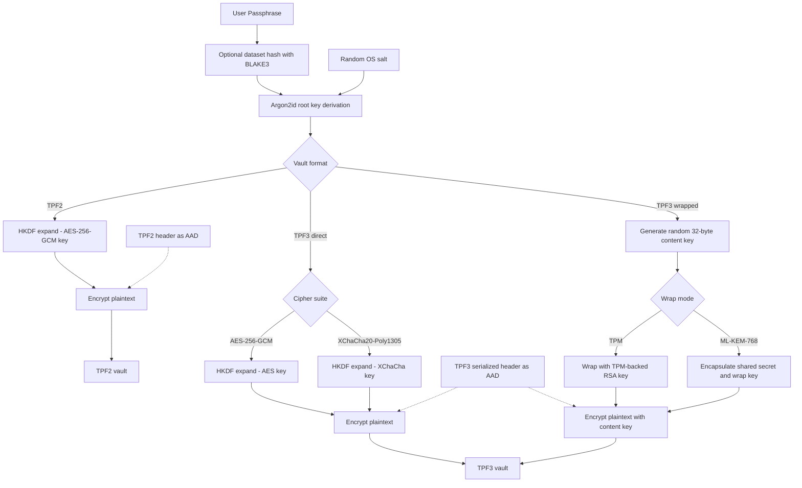

# 🌌 TripplePulsar Vault (TPV)

```text
┌──────────────────────────────────────────────────────────────────────────┐
│  ████████╗██████╗ ██╗██████╗ ██████╗ ██╗      ███████╗                   │
│  ╚══██╔══╝██╔══██╗██║██╔══██╗██╔══██╗██║      ██╔════╝                   │
│     ██║   ██████╔╝██║██████╔╝██████╔╝██║      █████╗                     │
│     ██║   ██╔══██╗██║██╔═══╝ ██╔═══╝ ██║      ██╔══╝                     │
│     ██║   ██║  ██║██║██║      ██║      ███████╗███████╗                  │
│     ╚═╝   ╚═╝  ╚═╝╚═╝╚═╝      ╚═╝      ╚══════╝╚══════╝                  │
│                                                                          │
│           T R I P P L E   P U L S A R   V A U L T                        │
│          "Tripple checking that security since 2026"                     │
└──────────────────────────────────────────────────────────────────────────┘
```

TripplePulsar Vault (TPV) is a Windows-oriented cryptographic file vault written in Rust. It focuses on memory-hardened key derivation, authenticated encryption, careful handling of sensitive material in memory, and an extensible authenticated container format.

## Current Capabilities

The current codebase supports:

- Legacy-compatible **TPF2** vaults
- Modern **TPF3** vaults
- **Argon2id + HKDF-SHA256** key derivation
- **AES-256-GCM** for TPF2 and TPF3
- **XChaCha20-Poly1305** for TPF3
- Optional external dataset hashing with **BLAKE3**
- **TPF3 direct/local derivation** mode
- **TPF3 TPM-wrapped content-key** mode
- **TPF3 ML-KEM-768 wrapped content-key** mode
- Windows clipboard clearing and best-effort memory-locking helpers
- TPM provider checks and TPM RSA key provisioning
- ML-KEM-768 keypair generation from the CLI
- Optional overwrite-and-delete of source plaintext files

## Architecture Overview



## Current Status

TripplePulsar Vault 3.0 now supports end-to-end local encryption, decryption, and header inspection for both TPF2 and TPF3, including wrapped-key TPF3 workflows.

**Implemented now**

- TPF2 encryption, decryption, and inspection
- TPF3 encryption, decryption, and inspection
- TPF3 direct/local derivation (`wrap_mode = None`)
- TPF3 TPM-wrapped content-key encryption and decryption
- TPF3 ML-KEM-768 wrapped content-key encryption and decryption
- TPF3 AES-256-GCM and XChaCha20-Poly1305 cipher selection
- Optional dataset-based derivation input using streaming BLAKE3
- Secure-exit helpers and optional plaintext source overwrite/delete
- Windows TPM provider checks and TPM RSA key provisioning
- ML-KEM-768 public/private keypair generation

## Core Security Properties

- **Memory-hardened derivation:** Argon2id uses explicit memory, time, and parallelism parameters stored in the vault header.
- **Domain separation:** HKDF-SHA256 expands encryption keys using format- and cipher-specific labels.
- **Tamper detection:** AEAD modes bind the serialized vault header as associated authenticated data.
- **Streaming dataset hashing:** BLAKE3 uses buffered reads, so large files do not need to be loaded fully into memory.
- **Secret handling:** `secrecy` and `zeroize` are used to reduce accidental retention of sensitive values.
- **Windows hygiene:** Clipboard wiping and best-effort memory locking are included.
- **Best-effort source cleanup:** Optional overwrite-and-delete is available for plaintext input files.

## Build Requirements

- Rust toolchain with Cargo
- Windows 10 or Windows 11
- TPM-backed workflows require a usable Microsoft Platform Crypto Provider on the host

## Build

```bash
git clone https://github.com/Entr0pyArchitect/tripple_pulsar_vault.git
cd tripple_pulsar_vault
cargo check
cargo build --release
```

## Run

```bash
cargo run --release
```

## CLI Menu

The current interactive menu provides:

1. Encrypt legacy-compatible TPF2 vault
2. Encrypt modern TPF3 vault
3. Decrypt vault
4. Inspect vault header
5. Check TPM provider
6. Provision TPM RSA key
7. Generate ML-KEM-768 keypair
8. Secure exit
0. Emergency exit

## Typical Workflows

### Encrypt a TPF2 vault

1. Select option `1`
2. Choose a plaintext input file
3. Choose a destination `.tpf2` path
4. Decide whether to include an auxiliary dataset
5. Decide whether to securely overwrite the original file
6. Enter the passphrase

### Encrypt a TPF3 vault

1. Select option `2`
2. Choose a plaintext input file
3. Choose a destination `.tpf3` path
4. Select a cipher suite
5. Select a wrap mode:
   - `1` direct/local derivation
   - `2` TPM-wrapped content key
   - `3` ML-KEM-768 wrapped content key
6. Decide whether to securely overwrite the original file
7. Complete the mode-specific inputs:
   - **Direct/local derivation:** optional dataset, then passphrase
   - **TPM-wrapped:** TPM scope and key alias
   - **ML-KEM-768 wrapped:** recipient public key path

### Decrypt a vault

1. Select option `3`
2. Provide the vault path
3. Choose the destination plaintext path
4. Complete the mode-specific inputs:
   - **TPF2:** optional dataset, then passphrase
   - **TPF3 direct/local derivation:** optional dataset, then passphrase
   - **TPF3 TPM-wrapped:** uses the TPM policy embedded in the header
   - **TPF3 ML-KEM-768 wrapped:** provide the matching private key path

### Generate an ML-KEM-768 keypair

1. Select option `7`
2. Provide the destination public key path
3. Provide the destination private key path

## TPF3 Wrap Modes

### Direct / Local Derivation

This mode derives the content-encryption key from:

- passphrase
- optional dataset hash
- random per-vault OS salt

Use this mode when you want password-based protection with optional deterministic dataset binding.

### TPM-Wrapped Content Key

This mode generates a random TPF3 content key and wraps it with a TPM-backed RSA key through the Windows platform crypto provider. The header stores:

- `wrapped_key`
- `tpm_policy`

Use this mode when you want the decryption path bound to the provisioned TPM-backed key material referenced by the embedded TPM policy.

### ML-KEM-768 Wrapped Content Key

This mode generates a random TPF3 content key and wraps it using an ML-KEM-768 recipient public key. The header stores:

- `wrapped_key`
- `kem_ciphertext`

Use this mode when you want the vault content key recoverable by the holder of the matching ML-KEM-768 private key.

## TPM Notes

The Windows code can:

- check whether the Microsoft Platform Crypto Provider is available
- check whether a persisted TPM-backed key already exists
- create and finalize a persisted TPM RSA key by alias
- wrap and unwrap TPF3 content keys using the provisioned TPM-backed RSA key

TPM-backed vault operation depends on the availability and behavior of the Microsoft Platform Crypto Provider on the host system.

## ML-KEM Notes

The ML-KEM workflow is file-based:

- generate a public/private keypair from the CLI
- distribute the public key to the encrypting side
- keep the private key for decryption

The current implementation uses ML-KEM-768 to derive a shared secret, expands a key-wrapping key with HKDF-SHA256, and wraps the random TPF3 content key under AES-256-GCM.

## Secure Deletion Notes

The secure erase routine is a **best-effort** overwrite-and-delete flow. It currently performs:

1. overwrite with random bytes
2. overwrite with zeros
3. delete the file

This may reduce recoverability on some storage, but it does **not** guarantee secure deletion on SSDs or other media that use wear-leveling, journaling, snapshots, or copy-on-write behavior.

## Threat Model Summary

TripplePulsar Vault is designed to help defend against:

- offline brute-force attempts against encrypted vault files
- ciphertext or header tampering
- accidental persistence of sensitive material in memory
- accidental recovery of plaintext files after encryption

It is **not** designed to protect against:

- a fully compromised operating system
- kernel-level malware or keyloggers
- hardware interception attacks
- passphrase compromise
- loss of the required external dataset
- privileged host compromise during runtime

## Project Notes

This project is best understood as a security engineering and cryptographic implementation exercise built around modern Rust crates and defensive systems design. It uses established primitives rather than custom cryptography.

## Disclaimer

TripplePulsar Vault is an experimental cryptographic project. It has not undergone independent professional security review or formal audit. Do not rely on it to protect critical secrets without additional review, testing, and validation.
