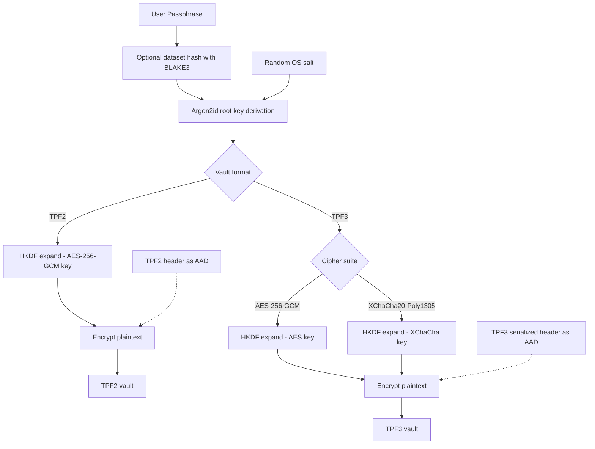

# 🌌 TripplePulsar Vault (TPV)

```text
┌──────────────────────────────────────────────────────────────────────────┐
│  ████████╗██████╗ ██╗██████╗ ██████╗ ██╗      ███████╗                   │
│  ╚══██╔══╝██╔══██╗██║██╔══██╗██╔══██╗██║      ██╔════╝                   │
│     ██║   ██████╔╝██║██████╔╝██████╔╝██║      █████╗                     │
│     ██║   ██╔══██╗██║██╔═══╝ ██╔═══╝ ██║      ██╔══╝                     │
│     ██║   ██║  ██║██║██║      ██║      ███████╗███████╗                  │
│     ╚═╝   ╚═╝  ╚═╝╚═╝╚═╝      ╚═╝      ╚══════╝╚══════╝                  │
│                                                                          │
│           T R I P P L E   P U L S A R   V A U L T                        │
│          "Tripple checking that security since 2026"                     │
└──────────────────────────────────────────────────────────────────────────┘
```

TripplePulsar Vault (TPV) is a Windows-oriented cryptographic file vault written in Rust. It focuses on memory-hardened key derivation, authenticated encryption, and careful handling of sensitive material in RAM.

The current codebase supports:

- Legacy-compatible **TPF2** vaults
- Modern **TPF3** vaults
- **Argon2id + HKDF-SHA256** key derivation
- **AES-256-GCM** for TPF2 and TPF3
- **XChaCha20-Poly1305** for TPF3
- Optional external dataset hashing with **BLAKE3**
- Windows clipboard clearing and memory-locking helpers
- TPM provider checks and TPM RSA key provisioning for future wrapped-key workflows

## Architecture Overview



## Current Status

TripplePulsar Vault 3.0 is in a working state for local encryption, decryption, and header inspection. The CLI currently builds cleanly and supports both TPF2 and direct-derivation TPF3 workflows. The codebase also includes TPM provider discovery and TPM RSA key provisioning on Windows.

**Implemented now**

- TPF2 encryption and decryption
- TPF3 encryption and decryption using direct/local derivation
- AES-256-GCM and XChaCha20-Poly1305 selection for TPF3
- Vault header inspection for TPF2 and TPF3
- Optional dataset-based key input using streaming BLAKE3
- Secure-exit helpers and optional source-file overwrite/delete
- Windows TPM provider checks and TPM RSA key provisioning

**Defined but not fully wired yet**

- TPF3 TPM-wrapped content-key encryption/decryption
- TPF3 ML-KEM-768 wrapped-key encryption/decryption

## Cryptographic Design

### Key Derivation

TPV derives keys from:

- the user passphrase
- an optional external dataset hash
- a random per-vault OS salt

The dataset, when used, is hashed in a streaming fashion with BLAKE3 so large files do not need to be loaded fully into memory.

High-level derivation flow:

```text
dataset_hash = BLAKE3(dataset)            // optional
IKM = passphrase || dataset_hash          // if dataset is used
root_key = Argon2id(IKM, os_salt)
enc_key = HKDF-SHA256(root_key, domain)
```

For TPF2, the vault uses the legacy-compatible header format while still using the newer key schedule for version 2 vaults. For TPF3, the content-encryption key is expanded with a cipher-specific HKDF domain so AES and XChaCha key material stay separated.

### Authenticated Encryption

- **TPF2:** AES-256-GCM
- **TPF3:** AES-256-GCM or XChaCha20-Poly1305

In both cases, the vault header is bound as **Associated Authenticated Data (AAD)** so tampering with header fields causes authentication failure during decryption.

## File Formats

### TPF2

TPF2 is the legacy-compatible format used for version 1 and version 2 vault parsing. The current code uses a fixed **62-byte** header with:

- magic
- version
- flags
- algorithm id
- KDF id
- Argon2 parameters
- TPM flag
- reserved bytes
- 32-byte salt
- 12-byte nonce

### TPF3

TPF3 is the modern format. It supports:

- variable nonce length based on cipher suite
- multiple wrap modes
- serialized variable-length blob sections
- modern header validation and parsing

Current TPF3 wrap modes in the format layer:

- `None`
- `TpmWrapped`
- `MlKem768`

At the moment, the CLI encryption/decryption path is implemented for `None` only.

## Core Security Properties

- **Memory-hardened derivation:** Argon2id is configured with explicit memory, time, and parallelism parameters.
- **Tamper detection:** AEAD modes bind the header as AAD.
- **Streaming dataset hashing:** BLAKE3 uses buffered reads for large inputs.
- **Secret handling:** `secrecy` and `zeroize` are used to reduce accidental exposure and persistence of key material.
- **Windows integration:** Clipboard wiping and best-effort memory locking are included.
- **Best-effort source cleanup:** Optional overwrite-and-delete is available for plaintext input files.

## Build Requirements

- Rust toolchain with Cargo
- Windows 10 or Windows 11

## Build

```bash
git clone https://github.com/Entr0pyArchitect/tripple_pulsar_vault.git
cd tripple_pulsar_vault
cargo deny check
cargo check
cargo build --release
```

## Run

```bash
cargo run --release
```

## CLI Menu

The current interactive menu provides:

1. Encrypt legacy-compatible TPF2 vault
2. Encrypt modern TPF3 vault
3. Decrypt vault
4. Inspect vault header
5. Check TPM provider
6. Provision TPM RSA key
7. Secure exit
0. Emergency exit

## Typical Workflow

### Encrypt a TPF2 vault

1. Select option `1`
2. Choose a plaintext input file
3. Choose a destination `.tpf2` path
4. Decide whether to include an auxiliary dataset
5. Decide whether to securely overwrite the original file
6. Enter the passphrase

### Encrypt a TPF3 vault

1. Select option `2`
2. Choose a plaintext input file
3. Choose a destination `.tpf3` path
4. Select a cipher suite
5. Select wrap mode `1` for direct/local derivation
6. Decide whether to include an auxiliary dataset
7. Decide whether to securely overwrite the original file
8. Enter the passphrase

### Decrypt a vault

1. Select option `3`
2. Provide the vault path
3. Choose the destination plaintext path
4. Provide the same dataset if one was used during encryption
5. Enter the passphrase

## TPM Notes

The Windows code can:

- check whether the Microsoft Platform Crypto Provider is available
- check whether a persisted TPM-backed key already exists
- create and finalize a persisted TPM RSA key by alias

That provisioning support is present now, but TPM-wrapped TPF3 content-key workflows are still pending in the main encrypt/decrypt path.

## Secure Deletion Notes

The secure erase routine is a **best-effort** overwrite-and-delete flow. It currently performs:

1. overwrite with random bytes
2. overwrite with zeros
3. delete the file

This may reduce recoverability on some storage, but it does **not** guarantee secure deletion on SSDs or other media that use wear-leveling, journaling, snapshots, or copy-on-write behavior.

## Threat Model Summary

TripplePulsar Vault is designed to help defend against:

- offline brute-force attempts against encrypted vault files
- ciphertext or header tampering
- accidental persistence of sensitive material in memory
- accidental recovery of plaintext files after encryption

It is **not** designed to protect against:

- a fully compromised operating system
- kernel-level malware or keyloggers
- hardware interception attacks
- passphrase compromise
- loss of the required external dataset

## Project Notes

This project is best understood as a security engineering and cryptographic implementation exercise built around modern Rust crates and defensive systems design. It uses established primitives rather than custom cryptography.

## Disclaimer

TripplePulsar Vault is an experimental cryptographic project. It has not undergone independent professional security review or formal audit. Do not rely on it to protect critical secrets without additional review, testing, and validation.
